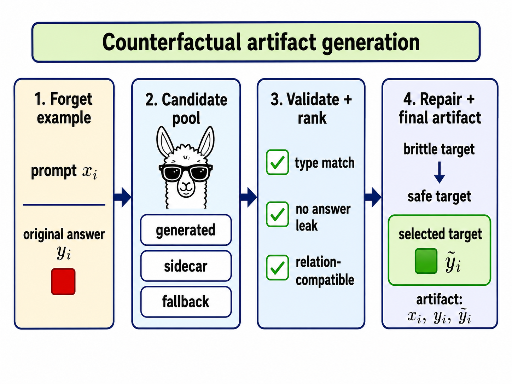
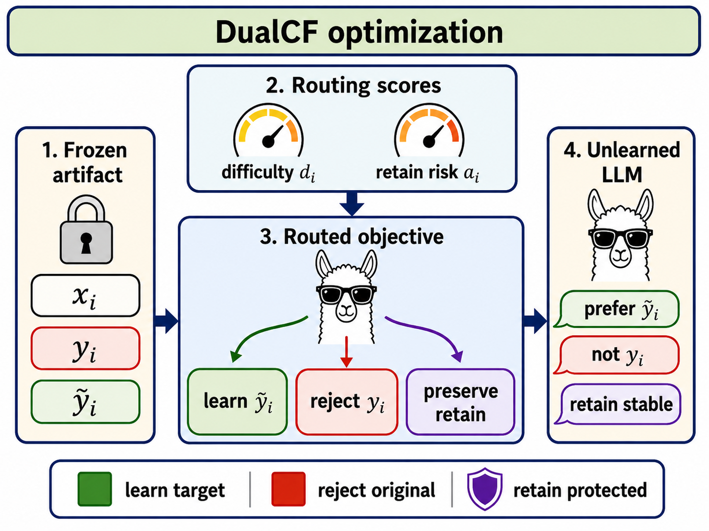

<div align="center">

# DualCF: Target-Aware Counterfactual Preference Unlearning

**Selective factual erasure by validating the replacement target before unlearning.**


</div>

DualCF is a target-aware unlearning method for factual QA: it builds validated
counterfactual targets, then trains with a routed objective that learns the
target, rejects the original answer, and protects retained behavior.

Selective factual unlearning should remove a target answer without destroying
nearby facts or general utility. In target-guided unlearning, the replacement
answer is part of the training signal; a copied, wrong-type, or brittle
replacement gives the optimizer a bad endpoint. DualCF separates this into two
auditable stages: counterfactual artifact construction and routed
counterfactual optimization.

On DUET Rare, holding the optimizer fixed while improving only the
counterfactual artifact moves the forget score from `32.8` to `0.7` while
preserving high holdout and utility (`H=96.5`, `U=56.9`). Against the current
19-baseline comparison on DUET and RWKU, DualCF gives a stronger selective
trade-off than destructive deletion methods that lower forgetting by collapsing
holdout or utility.

<p align="center">
  
  
</p>

## Why Target Quality Matters

Negative-only unlearning can suppress the original answer, but it can also
produce collapse, nonsensical answers, or locality damage. Preference-style
unlearning needs a preferred response. For factual unlearning, that response is
a counterfactual target, and its validity is central to the method.

Rare facts are especially brittle: generators may return obscure entities,
wrong-type replacements, over-specific answers, or strings that leak the
original answer. DualCF makes the target endpoint explicit, validated, and
frozen before training.

## Method: DualCF In Two Stages

```text
Stage A: Counterfactual artifact construction
    forget question + original answer
    -> candidate generation
    -> leakage/type/overlap validation
    -> relation-aware ranking
    -> optional repair/fallback
    -> frozen artifact row with alternate + provenance + offline scores

Stage B: Routed counterfactual optimization
    consume frozen alternate, difficulty_score, attribution_score
    -> learn selected alternate
    -> reject original answer
    -> preserve retained behavior
```

| Artifact | Meaning |
|---|---|
| `CF-Single` | One generated/selected alternate per forget example. |
| `CF-Multi` | Eight OpenAI/Codex/ChatGPT-Pro generated candidates per row; a deterministic validator/ranker selects one final alternate. |
| `CF-Repair` | Repairs the multi-candidate artifact where repair is active. Active on DUET Rare and the rare side of DUET Merged; equal to `CF-Multi` on DUET Popular and RWKU. |

| Split | Rows |
|---|---:|
| DUET Rare | 482 |
| DUET Popular | 482 |
| DUET Merged | 964 |
| RWKU Level 2 | 2879 |

## Objective

The trainer consumes a frozen row
`(x, y_orig, y_cf, difficulty_score, attribution_score)` and optimizes a
practical decomposition:

```text
L = L_cf(x, y_cf) + lambda_neg_i L_NPO(x, y_orig) + alpha_eff L_ret
```

- `L_cf` learns the selected counterfactual target.
- `L_NPO` suppresses the original answer.
- `L_ret` anchors retained behavior.
- Difficulty routing increases rejection pressure for examples that remain easy
  to answer.
- Attribution-risk routing reduces aggressive forget updates and increases
  retain protection when a forget update is likely to interfere with retained
  behavior.

For the reported setup:

```text
s_i = sigmoid((difficulty_i - 0.6) / 0.15)
r_i = sigmoid((attribution_i - 0.6) / 0.15)

lambda_neg = s_i * (1 - r_i)
forget_scale = 1 - 0.5 * r_i
alpha_eff = 1 + 2 * topk_mean_25%(r_i over the batch)
```

The final method also uses span masking and an NPO-SAM branch. Full details are
in [docs/dualcf_repro.md](docs/dualcf_repro.md) and
[prod-run-dual-gpu.md](prod-run-dual-gpu.md).

## Repository Map

| Purpose | Files |
|---|---|
| Trainers | [dual_cf.py](src/trainer/unlearn/dual_cf.py), [general_cf.py](src/trainer/unlearn/general_cf.py), [span_cf.py](src/trainer/unlearn/span_cf.py), [span_cf_samnpo.py](src/trainer/unlearn/span_cf_samnpo.py) |
| Trainer configs | [DualCF.yaml](configs/trainer/DualCF.yaml), [GeneralCF.yaml](configs/trainer/GeneralCF.yaml), [SpanCF.yaml](configs/trainer/SpanCF.yaml), [SpanCFSAMNPO.yaml](configs/trainer/SpanCFSAMNPO.yaml) |
| DUET/RWKU configs | [configs/experiment/unlearn/duet](configs/experiment/unlearn/duet), [configs/experiment/unlearn/rwku](configs/experiment/unlearn/rwku) |
| Artifact generation | [make_counterfactuals.py](src/tools/make_counterfactuals.py), [clean_counterfactuals.py](src/tools/clean_counterfactuals.py), [score_difficulty.py](src/tools/score_difficulty.py), [score_attribution.py](src/tools/score_attribution.py), [calibrate_dual_cf_scores.py](src/tools/calibrate_dual_cf_scores.py), [validate_dual_cf_artifact.py](src/tools/validate_dual_cf_artifact.py) |
| Campaign launchers | [run_campaign_one_lr.sh](scripts/dualcf/run_campaign_one_lr.sh), [scripts/duet](scripts/duet), [scripts/rwku](scripts/rwku) |
| Result processing | [build_structured_saves.py](src/tools/build_structured_saves.py), [build_results_combine_tables.py](src/tools/build_results_combine_tables.py), [calc_cos_sim.py](scripts/calc_cos_sim.py), [calc_wrong_generations.py](scripts/calc_wrong_generations.py), [package_saves.sh](package_saves.sh) |
| Production runbook | [prod-run-dual-gpu.md](prod-run-dual-gpu.md) |

## Setup

Quick local setup for reading configs and running lightweight utilities:

```bash
git clone git@github.com:vValkroVv/unlearning-acl.git
cd unlearning-acl
python3 -m venv .venv
source .venv/bin/activate
python -m pip install --upgrade pip setuptools wheel
```

GPU environment matching the maintained runbooks:

```bash
bash setup_vast_env.sh
source .venv/bin/activate
```

`setup_vast_env.sh` installs the runtime used by the DualCF scripts, including
`torch==2.4.1` with CUDA 12.4 wheels, `transformers==4.45.1`,
`accelerate==0.34.2`, `datasets==3.0.1`, `peft==0.15.2`,
`flash-attn==2.6.3`, `bitsandbytes==0.44.1`, `lm-eval==0.4.8`, and related
runtime tools. `requirements.txt` is the clean CPU/public dependency set used
by `setup.py`; `requirements-gpu.txt` mirrors the GPU runtime packages from
the production setup script.

Use placeholders for local storage paths:

```bash
export REPO_ROOT=$PWD
export DATA_ROOT=/path/to/unlearning-data
export HF_HOME=${DATA_ROOT}/.hf_home
export HF_DATASETS_CACHE=${DATA_ROOT}/.hf_datasets_cache
export TRITON_CACHE_DIR=${DATA_ROOT}/.triton
export CUDA_DEVICE_ORDER=PCI_BUS_ID
mkdir -p "$HF_HOME" "$HF_DATASETS_CACHE" "$TRITON_CACHE_DIR"
```

Offline production runs expect local mirrors such as:

```text
${DATA_ROOT}/SwetieePawsss/DUET
${DATA_ROOT}/SwetieePawsss/exp_r
${DATA_ROOT}/SwetieePawsss/DUET_ft_models
${DATA_ROOT}/models/BASE/Llama-3.1-8B-Instruct
```

## Sanity Checks

```bash
source .venv/bin/activate
pip check
python src/train.py --help >/dev/null
python src/eval.py --help >/dev/null
python setup_data.py --help >/dev/null
python src/tools/validate_dual_cf_artifact.py --help >/dev/null
```

If CUDA is available:

```bash
python - <<'PY'
import torch
print("cuda_available", torch.cuda.is_available())
if torch.cuda.is_available():
    print("gpu", torch.cuda.get_device_name(0))
PY
```

## Validate An Artifact Before Training

DUET:

```bash
python src/tools/validate_dual_cf_artifact.py \
  --artifact-path /path/to/dualcf_rare_v2.jsonl \
  --question-key question \
  --reject-gold-substring \
  --require-short-answer \
  --check-overlap-ratio 0.85 \
  --strict
```

RWKU:

```bash
python src/tools/validate_dual_cf_artifact.py \
  --artifact-path /path/to/dualcf_forget_level2_v2.jsonl \
  --question-key query \
  --reject-gold-substring \
  --require-short-answer \
  --check-overlap-ratio 0.85 \
  --strict
```

Expected trainer-facing schema:

```json
{
  "index": 17,
  "question": "...",
  "answer": "...",
  "alternate": "...",
  "difficulty_score": 0.73,
  "attribution_score": 0.18
}
```

`rarity_score` can exist for compatibility, but the reported optimizer consumes
`difficulty_score` and `attribution_score`.

## Minimal Smoke Run

Use local JSON mode and quote `cf_dataset_split`, because Hydra treats bracket
slices as grammar unless quoted.

```bash
python src/train.py --config-name=unlearn.yaml \
  experiment=unlearn/duet/dual_cf_lora.yaml \
  trainer=DualCF \
  model=Llama-3.2-1B-Instruct-lora \
  task_name=duet_dualcf_smoke \
  forget_split=city_forget_rare_5 \
  retain_split=city_fast_retain_500 \
  cf_dataset_path=json \
  cf_dataset_data_files=/path/to/dualcf_rare_v2.jsonl \
  "cf_dataset_split='train[:2]'" \
  trainer.args.per_device_train_batch_size=1 \
  trainer.args.gradient_accumulation_steps=1 \
  trainer.args.num_train_epochs=1 \
  +trainer.args.max_steps=1 \
  trainer.args.learning_rate=1e-5 \
  paths.output_dir=/tmp/duet_dualcf_smoke
```

Expected checks: training completes without OOM, `dualcf_*` logs appear,
`difficulty_score` and `attribution_score` reach the trainer, and an adapter
checkpoint is saved.

## Reproduce The Reported Campaign

The full production path is in [prod-run-dual-gpu.md](prod-run-dual-gpu.md).
For the paper-facing full GeneralCF-style DualCF row:

```bash
source .venv/bin/activate

export ARTIFACT_ROOT=/path/to/artifacts/dualcf
export ALTPO_ARTIFACT_ROOT=/path/to/artifacts/altpo
export OUTPUT_ROOT=/path/to/saves/unlearn
export HF_HOME=/path/to/.hf_home
export HF_DATASETS_CACHE=/path/to/.hf_datasets_cache
export TRITON_CACHE_DIR=/path/to/.triton
export HF_HUB_OFFLINE=1
export TRANSFORMERS_OFFLINE=1
export HF_DATASETS_OFFLINE=1
export CUDA_DEVICE_ORDER=PCI_BUS_ID

GPU_ID=0
SEEDS="42 179 1137" \
METHOD_VARIANTS="general_cf" \
ADDITIONAL_LOSS=NPO-SAM \
ROUTING=full \
SPAN_ADDITIONAL=true \
SPAN_CF_BRANCH=true \
DISABLE_RARITY_ROUTES=true \
DISABLE_DIFFICULTY_ROUTES=false \
DISABLE_ATTRIBUTION_ROUTES=false \
RARITY_NEG_GAINS="0.0" \
RARITY_CF_GAINS="0.0" \
SPAN_MODE=lcs \
SPAN_ALT_SHARED_TOKEN_WEIGHT=0.0 \
SPAN_ALT_UNIQUE_TOKEN_WEIGHT=1.0 \
SPAN_ORIG_SHARED_TOKEN_WEIGHT=0.0 \
SPAN_ORIG_UNIQUE_TOKEN_WEIGHT=1.0 \
BETAS=0.1 \
GAMMAS=1.0 \
SPAN_SAM_RHO=0.01 \
SPAN_SAM_ADAPTIVE=false \
bash scripts/dualcf/run_campaign_one_lr.sh "${GPU_ID}" 1e-4 all
```

## Results

All values are percentages. `F↓` is the original-answer forget score, `H↑` is
holdout/locality, and `U↑` is general utility. The metrics must be read
together.

| Split | DualCF F↓ | DualCF H↑ | DualCF U↑ |
|---|---:|---:|---:|
| DUET Rare | 0.7 | 96.5 | 56.9 |
| DUET Popular | 6.5 | 98.8 | 57.2 |
| DUET Merged | 1.9 | 98.7 | 56.6 |
| RWKU | 8.8 | 96.8 | 57.3 |

Artifact quality under the same full objective:

| Split | Artifact | F↓ | H↑ | U↑ |
|---|---|---:|---:|---:|
| DUET Rare | CF-Single | 32.8 | 98.5 | 56.8 |
| DUET Rare | CF-Multi | 5.6 | 97.7 | 56.0 |
| DUET Rare | CF-Repair | 0.7 | 96.5 | 56.9 |
| DUET Popular | CF-Single | 2.9 | 98.2 | 56.9 |
| DUET Popular | CF-Multi | 6.5 | 98.8 | 57.2 |
| DUET Popular | CF-Repair | 6.5 | 98.8 | 57.2 |
| DUET Merged | CF-Single | 17.6 | 99.0 | 56.2 |
| DUET Merged | CF-Multi | 5.9 | 99.2 | 56.5 |
| DUET Merged | CF-Repair | 1.9 | 98.7 | 56.6 |
| RWKU | CF-Single | 12.6 | 96.3 | 56.6 |
| RWKU | CF-Multi | 8.8 | 96.8 | 57.3 |
| RWKU | CF-Repair | 8.8 | 96.8 | 57.3 |

Selected baseline contrasts:

| Split | Method | F↓ | H↑ | U↑ | Interpretation |
|---|---|---:|---:|---:|---|
| DUET Rare | DualCF | 0.7 | 96.5 | 56.9 | strong forgetting with high locality/utility |
| DUET Rare | GA | 0.0 | 0.0 | 36.6 | destructive collapse |
| DUET Rare | LoKU | 0.8 | 97.3 | 47.0 | strong forgetting, high utility cost |
| DUET Rare | WGA | 1.6 | 97.3 | 56.5 | strong competitor |
| DUET Rare | AltPO | 36.7 | 99.9 | 56.3 | target-guided but weak rare forgetting |
| DUET Merged | DualCF | 1.9 | 98.7 | 56.6 | stable mixed rare/popular setting |
| DUET Merged | GA | 0.0 | 0.1 | 45.6 | destructive collapse |
| DUET Merged | WGA | 7.8 | 99.0 | 56.4 | strong but less deletion |
| RWKU | DualCF | 8.8 | 96.8 | 57.3 | balanced real-world knowledge setting |
| RWKU | Unilogit | 2.5 | 95.9 | 58.2 | strong raw-forgetting competitor |
| RWKU | WGA | 6.2 | 97.4 | 58.4 | strong competitor |
| RWKU | GA | 0.1 | 0.0 | 31.8 | destructive collapse |

The full Markdown result summary is in [docs/results.md](docs/results.md).
The source LaTeX tables copied from the paper workspace are in
[docs/paper_tables](docs/paper_tables).

## Baseline Coverage

| Family | Methods |
|---|---|
| Classical loss-based | GA, GradDiff, NPO, CE-U |
| Preference / replacement-answer | DPO, AltPO, FLAT, TPO |
| Representation-level | RMU, Adaptive RMU |
| Logit-space / distribution shaping | UnDIAL, Unilogit, STAT, PDU |
| Difficulty / token selectivity | SimNPO, WGA, SatImp, LoKU |
| Robustness / relearning resistance | NPO-SAM |

This is the current 19-baseline comparison scope.

## Main Takeaways

1. **Counterfactual target construction is not a preprocessing detail.** Under
   the same optimizer, moving from `CF-Single` to `CF-Multi` to `CF-Repair`
   reduces DUET Rare `F` from `32.8` to `5.6` to `0.7`.
2. **Raw forgetting alone is misleading.** GA and FLAT can push `F` near zero,
   but often collapse holdout/locality or utility.
3. **Routing complements target repair.** Routing and original-answer
   suppression help most when the selected target is plausible but still noisy.
4. **Repair is split-dependent.** Repair is active for DUET Rare and the rare
   side of DUET Merged; it is inactive for DUET Popular and RWKU.
5. **Evaluation must be split-matched.** Rare, popular, merged, and RWKU
   artifacts/runs are separate.

## Further Documentation

| Document | Contents |
|---|---|
| [docs/dualcf_repro.md](docs/dualcf_repro.md) | Environment, artifact validation, smoke runs, production wrapper, and post-run analysis. |
| [docs/results.md](docs/results.md) | Result definitions, full F/H/U matrix, artifact table, and ablation pointers. |
| [docs/artifacts.md](docs/artifacts.md) | Artifact schema, validation rules, artifact levels, and routing boundary. |
| [docs/experiments.md](docs/experiments.md) | Upstream Hydra experiment guide. |
| [docs/evaluation.md](docs/evaluation.md) | Upstream evaluation guide. |
| [docs/hydra.md](docs/hydra.md) | Hydra configuration notes. |

## Citing

DualCF manuscript:

```bibtex
@misc{kropotin2026dualcf,
  title  = {Target-Aware Counterfactual Preference Unlearning for Selective Factual Erasure},
  author = {Kropotin, Valerii},
  year   = {2026},
  note   = {Diploma thesis manuscript}
}
```

This repository builds on OpenUnlearning. If you use the framework, cite the
upstream technical report:

```bibtex
@article{openunlearning2025,
  title={{OpenUnlearning}: Accelerating {LLM} Unlearning via Unified Benchmarking of Methods and Metrics},
  author={Dorna, Vineeth and Mekala, Anmol and Zhao, Wenlong and McCallum, Andrew and Lipton, Zachary C and Kolter, J Zico and Maini, Pratyush},
  journal={arXiv preprint arXiv:2506.12618},
  year={2025},
  url={https://arxiv.org/abs/2506.12618}
}
```

## Acknowledgements

This repository builds on the OpenUnlearning framework and extends it with
DualCF artifact construction, routed counterfactual optimization, DUET/RWKU
launchers, artifact validation, and result-processing utilities. See
[LICENSE](LICENSE) and the upstream OpenUnlearning documentation for the
original framework.

## License

This project is licensed under the MIT License. See [LICENSE](LICENSE).
